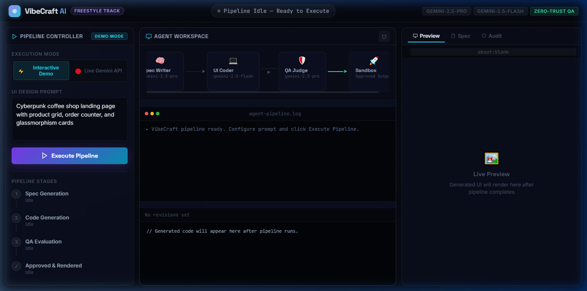
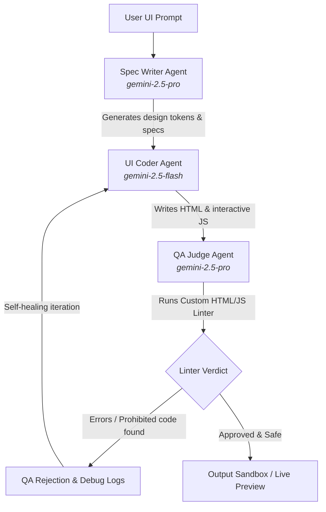

# ⚡ VibeCraft AI — Autonomous UI Dev & QA Pipeline

VibeCraft AI is a premium, real-time autonomous multi-agent developer pipeline that takes visual or textual UI prompts, creates detailed specifications, generates code, runs strict automated QA validation, performs self-repair on any syntax or security issues, and previews the final output in an interactive sandbox.



## 🚀 Key Features

*   **Multi-Agent Orchestration**: Separates concerns between a **Spec Writer**, a **UI Coder**, and a **QA Judge** to build robust code iteratively.
*   **Zero-Trust QA Validation**: Uses a custom-built, regex- and stack-based syntax/security linter to check for unclosed HTML tags and security violations (such as `eval()`, unsafe DOM manipulation with `document.write()`, and unencrypted HTTP script links).
*   **Self-Healing Loop**: If the QA Judge detects any issues, the UI Coder automatically processes the linting output, generates a repaired code revision, and re-submits it until validation passes.
*   **Live Gemini API vs. Interactive Demo**: Run the pipeline in **Demo Mode** to visualize the pipeline in action, or provide your own **Gemini API Key** to execute the pipeline live using Google's Generative AI model (`gemini-2.5-pro` & `gemini-2.5-flash`).
*   **Real-time SSE Streaming**: Emits agent thoughts, tool calls, and workspace updates sequentially via Server-Sent Events (SSE) so users can observe the agent reasoning process as it happens.
*   **Interactive Revision Tabs & Live Preview**: Cycle through different code revisions and watch the final, approved layout render instantly inside a secure preview sandbox iframe.

---

## 📐 Multi-Agent Workflow



---

## 📁 File Structure

*   [server.js](server.js): Express backend server. Manages simulated and live pipeline logic, interacts with Gemini API, handles SSE event streaming, and exposes APIs for previewing sandboxed outputs.
*   [linter.js](linter.js): Custom syntax validator and security scanning module.
*   [public/](public/): Client-side files for the premium glassmorphism dashboard UI.
    *   [index.html](public/index.html): HTML page containing the layout shell, stage trackers, live DAG visualizer, terminal console, and code tabs.
    *   [style.css](public/style.css): Premium CSS containing dynamic glowing variables, background grid layers, active orbs, code editor themes, and interactive animations.
    *   [app.js](public/app.js): App logic that processes Server-Sent Events from the server, updates the interactive DOM, and switches between code revisions.
*   [images/](images/): Contains application assets such as screenshots.
*   `output_sandbox/`: Directory created during execution to store generated HTML component versions securely.

---

## 🛠️ Setup & Local Running Instructions

### Prerequisites
Make sure you have [Node.js](https://nodejs.org/) (v18 or higher recommended) installed.

### 1. Install Dependencies
Run the following command in the project directory:
```bash
npm install
```

### 2. Start the Server
Start the local development server:
```bash
npm run dev
```

### 3. Open the Dashboard
Navigate to the following address in your browser:
```
http://localhost:3000
```

*To run live generations, toggle to "Live Gemini API" mode in the controller pane and enter your Google AI Studio API key.*
